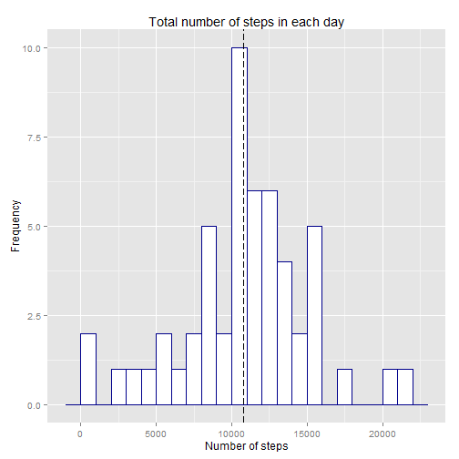

---
title: "Reproducible Research: Peer Assessment 1"
output: html_document
    keep_md: true
---

**This document contains the completed work for peer assignment #1 for the Coursera Reproducable Research class.**

## Loading and preprocessing the data
Questions for assessment are:
1. Calculate the total number of steps taken per day
2. Make a histogram of the total number of steps taken each day

First step of the analysis is the loading and preprocessing data.
The assumption is that data is stored in local working directory.
The analysis starts with loading necessary libraries and read data to create the initial dataset


## What is mean total number of steps taken per day?
For this question, NA values are ignored.

First the dataset is summarized, to create a new dataset with the measure of total number of stepstaken each day   

```r
dataperday <- summarize(group_by(select(dataset, c(1:2)), date), stepsperday=sum(steps))
head(dataperday)
```

```
## Source: local data frame [6 x 2]
## 
##         date stepsperday
## 1 2012-10-01          NA
## 2 2012-10-02         126
## 3 2012-10-03       11352
## 4 2012-10-04       12116
## 5 2012-10-05       13294
## 6 2012-10-06       15420
```

From this dataset we easily calculate the mean of total number of steps taken per day

```r
mean_total <- mean(dataperday$stepsperday,na.rm=TRUE)
mean_total
```

```
## [1] 10766.19
```

And the median

```r
median_total <- median(dataperday$stepsperday,na.rm=TRUE)
median_total
```

```
## [1] 10765
```

In a graph the difference between median and mean is not evaluable.
The frequency of the total number of steps taken each day, and the mean, graphically is

```r
g1<-ggplot(dataperday,aes(stepsperday))
g1<-g1+geom_histogram(colour = "darkblue", fill = "white",binwidth=1000)+labs(title="Total number of steps in each day",x="Number of steps",y="Frequency")+ylim(0,10)
g1+geom_vline(xintercept = mean_total, colour="green", linetype = "longdash")+geom_vline(xintercept = median_total, colour="black", linetype = "longdash")
```

 

## What is the average daily activity pattern?
Questions for assessment are:
1. Make a time series plot (i.e. type = "l") of the 5-minute interval (x-axis) and the average number of steps taken, averaged across all days (y-axis)
2. Which 5-minute interval, on average across all the days in the dataset, contains the maximum number of steps?

For these questions, NA values are ignored.
Calculate and report the mean and median of the total number of steps taken per day
The initial the dataset is summarized, to create a new dataset with the mean of steps taken each interval  

```r
dataperinterval <- summarize(group_by(select(dataset, c(1,3)), interval), stepsperminuteinterval=mean(steps,na.rm=TRUE))
head(dataperinterval)
```

```
## Source: local data frame [6 x 2]
## 
##   interval stepsperminuteinterval
## 1        0              1.7169811
## 2        5              0.3396226
## 3       10              0.1320755
## 4       15              0.1509434
## 5       20              0.0754717
## 6       25              2.0943396
```
The interval with maximun mean of steps is now calculated

```r
maxsteps_interval <- dataperinterval[dataperinterval$stepsperminuteinterval==max(dataperinterval$stepsperminuteinterval),2]
maxsteps_interval
```

```
## Source: local data frame [1 x 1]
## 
##   stepsperminuteinterval
## 1               206.1698
```
So interval with maximum steps is 8:35

And graphically we can see the distribution

```r
g2<-ggplot(dataperinterval,aes(y=stepsperminuteinterval,x=interval,group=1))
g2<-g2+geom_line(colour = "darkblue", fill = "white")+labs(title="Total number of steps in each day",y="Number of steps",x="Day Intervals")
g2+theme(axis.text.x  = element_text(angle=90, vjust=0.5, size=16))+geom_vline(xintercept = as.integer(maxsteps_interval), colour="black", linetype = "longdash")+annotate("text", x = as.integer(maxsteps_interval), y = -2, label = as.character(maxsteps_interval))
```

 

## Inputing missing values
Questions for assessment are:
1. Calculate and report the total number of missing values in the dataset (i.e. the total number of rows with NAs)
2. Devise a strategy for filling in all of the missing values in the dataset. The strategy does not need to be sophisticated.
3. Create a new dataset that is equal to the original dataset but with the missing data filled in.
4. Make a histogram of the total number of steps taken each day and Calculate and report the mean and median total number of steps taken per day. Do these values differ from the estimates from the first part of the assignment? What is the impact of imputing missing data on the estimates of the total daily number of steps?

In the initial dataset there are some NA value

```r
numberofNA <- as.integer(count(dataset[is.na(dataset),]))
numberofNA
```

```
## [1] 2304
```

The strategy to fill NA values is: if an interval has NA as number of step then it's filled with average steps for this interval.

There is a dataset with calculated mean for each interval, elaborated in previous question.
Then the dataset is summarized to obtain the total number of steps taken per day

```r
dataset_filled <- merge(dataset, dataperinterval, by.x="interval", by.y="interval")
for (i in 1:nrow(dataset_filled)){
  if (is.na(dataset_filled$steps[i])) dataset_filled$steps[i] <- round(dataset_filled$stepsperminuteinterval[i],digits=0)
}
dataperday_filled <- summarize(group_by(select(dataset_filled, c(2:3)), date), stepsperday=sum(steps))
head(dataperday_filled)
```

```
## Source: local data frame [6 x 2]
## 
##         date stepsperday
## 1 2012-10-01       10762
## 2 2012-10-02         126
## 3 2012-10-03       11352
## 4 2012-10-04       12116
## 5 2012-10-05       13294
## 6 2012-10-06       15420
```

From this filled dataset (without NA), the mean returns

```r
mean_total_filled <- mean(dataperday_filled$stepsperday)
mean_total_filled
```

```
## [1] 10765.64
```

And the median

```r
median_total_filled <- median(dataperday_filled$stepsperday)
median_total_filled
```

```
## [1] 10762
```

With this filling strategy (use mean for each interval), the difference between a dataset with or without NA is:

For mean

```r
mean_total-mean_total_filled
```

```
## [1] 0.549335
```
and for median

```r
median_total-median_total_filled
```

```
## [1] 3
```

Graphically the histogram of filled dataset is quite different

```r
g3<-ggplot(dataperday_filled,aes(stepsperday))
g3<-g3+geom_histogram(colour = "darkblue", fill = "white",binwidth=1000)+labs(title="Total number of steps in each day",x="Number of steps",y="Frequency")
g3+geom_vline(xintercept = mean_total, colour="green", linetype = "longdash")+geom_vline(xintercept = median_total, colour="black", linetype = "longdash")
```

 


## Are there differences in activity patterns between weekdays and weekends?
Questions for assessment are:
1. Create a new factor variable in the dataset with two levels - "weekday" and "weekend" indicating whether a given date is a weekday or weekend day.
2. Make a panel plot containing a time series plot (i.e. type = "l") of the 5-minute interval (x-axis) and the average number of steps taken, averaged across all weekday days or weekend days (y-axis).
    
To evaluate differences between weekdays and weekend, the analysis uses the filled dataset.
First step is the addition of a new column to dataset to identify if a day is weekday or weekend.
Then the dataset is summarize to obtain the average number of steps taken in each interval, averaged across all weekday days or weekend days

```r
for (i in 1:nrow(dataset_filled)){
  if (weekdays(as.Date(dataset_filled$date[i])) %in% c('Saturday','Sunday')) { dataset_filled$typeofday[i] <- "weekend" }
  else { dataset_filled$typeofday[i] <- "weekday" }
}
dataset_filled$typeofday <- as.factor(dataset_filled$typeofday)
dataset_intervalday_filled <- summarize(group_by(select(dataset_filled, c(1,2,6)), interval, typeofday), stepsperday=mean(steps))
```

```
## Error in eval(expr, envir, enclos): Position must be between 0 and n
```

```r
head(dataset_intervalday_filled)
```

```
## Source: local data frame [6 x 3]
## Groups: interval
## 
##   interval typeofday stepsperday
## 1        0   weekday   2.2888889
## 2        0   weekend   0.2500000
## 3        5   weekday   0.4000000
## 4        5   weekend   0.0000000
## 5       10   weekday   0.1555556
## 6       10   weekend   0.0000000
```

The graph shows a difference between weekdays and weekend

```r
g4<-ggplot(dataset_intervalday_filled,aes(x=interval,y=stepsperday))
g4+geom_line(colour = "darkblue")+labs(y="Number of steps",x="Interval")+ facet_grid(typeofday ~ .)
```

 

During weekdays the steps are concentrate before 10:00, before the working day starts, and steps remain lower than weekend after 10:00.
This indicates a different pattern between weekdays and weekend.

